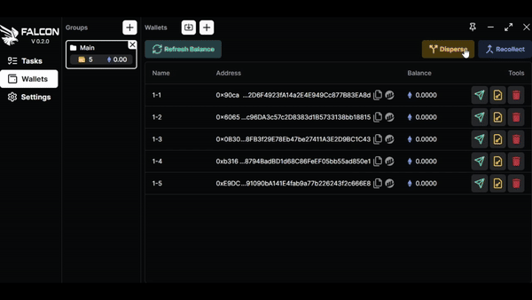

# Disperse & Merge

To distribute and fund your newly created or imported wallets, click the "Disperse" button. Choose the wallet from which you want to send ETH, select the destination wallet(s), set the gas and priority, enter the desired amount that you want to send for each wallets, and then proceed to send.

<figure><figcaption>
How to disperse your funds
</figcaption></figure>

To gather and consolidate funds into your designated wallet, click the "Recollect" button. Choose the wallet from which you wish to collect ETH, specify the target wallet for receiving, set the gas and priority, enter the desired amount to send per wallet, and complete the collection process.
