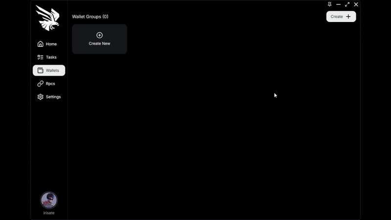

# Wallet

Setting up wallets is a breeze with Falcon. First of all, you must create a wallet group with a name of your choice. You will then have the option of generating wallets directly within Falcon, or import some of your own wallets providing the private key.\
Upon generation, a .txt file will be created containing private keys to your newly generated wallets.

<figure><figcaption>
Creation of a wallet group and 5 new wallets
</figcaption></figure>

Import your own personal wallet to Falcon using the button .png>)


Do not forget to save your file containing all your private key in a secure manner so you do not loose access to those wallets.

