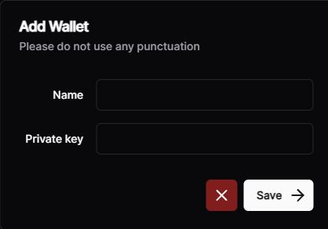

# ✅ Getting started

Once you have falcon's nft in your wallet head over to [https://www.falconmint.tech/dashboard](https://www.falconmint.tech/dashboard)\
\
Connect the wallet where you hold the nft to get access to the dashboard.\

Then click download for Windows (Mac not available for now)

<figure><figcaption></figcaption></figure>

Once you downloaded the bot in your pc it will ask you for your License key which can be found in falcon's dashboard too. Press copy to clipboard and then paste it in your bot to get access

<figure><figcaption></figcaption></figure>
