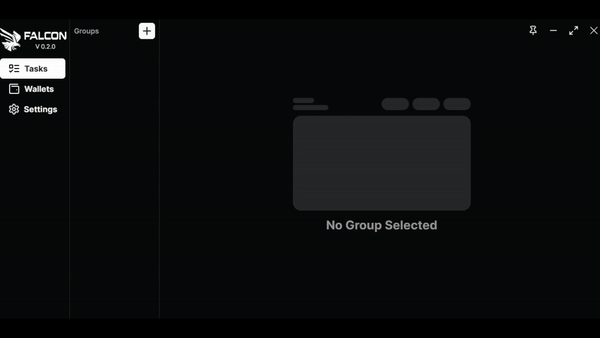

# Creation of a task group

To start, create a group to keep your minting tasks organised, give it a name and enter the contract adress for the nft you're looking to mint.

<figure><figcaption>
Creation of a task group
</figcaption></figure>

