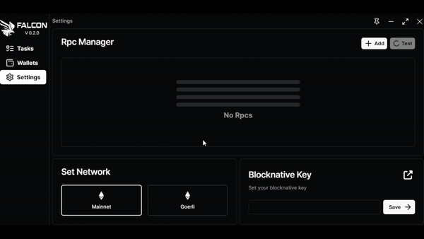

# Settings And RPC Manager

In this section, we will guide you through the process of incorporating a custom public or private node.\\

<figure><figcaption>
Adding your node to Falcon
</figcaption></figure>

To incorporate a private or public node, navigate to the settings tab, click on "Add," input the desired name for your node, provide the corresponding link, and click "Save".\
You can then test it using this button  to see your ping.\
\
<mark style="color:red;">**Please note that node can be rate limited. You need to know your rate limit depending on which node provider you're using. This can lead to transactions not being sent and the your mint failing.**</mark>\
\
For example Alchemy limits is 3 at a time. Find more explantion about rate limit on [alchemy website](https://docs.alchemy.com/reference/throughput#what-are-compute-units-per-second-cups).

