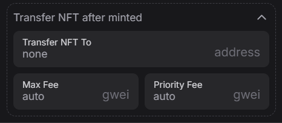

# Importing your wallets

You can add your own personal wallet to Falcon using this button 

<figure><figcaption>
Simply assign a name to your wallet and copy the private key
</figcaption></figure>

You'll encounter a window where you can input the private key of the wallet you intend to import, along with assigning a name to it.\
