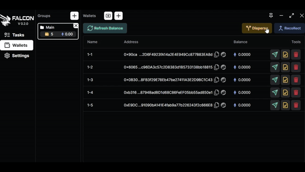

# Manage your wallets

To distribute and fund your newly created wallet, click the "Disperse" button. Choose the wallet from which you want to send ETH, select the destination wallet, set the gas and priority, enter the desired amount, and then proceed to send.

<figure><figcaption>
How to disperse your funds
</figcaption></figure>

To gather and consolidate funds into your designated wallet, click the "Recollect" button. Choose the wallet from which you wish to collect ETH, specify the target wallet for receiving, set the gas and priority, enter the desired amount to send per wallet, and complete the collection process.\
\
<mark style="color:red;">**Do not forget to export your private key of your newly created wallets using this button**</mark> \
\
